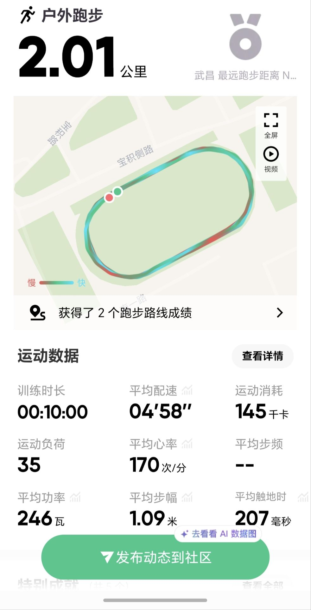

# KeepTrack

KeepTrack是一个用于生成自定义跑步运动轨迹数据（FIT格式）的 Windows 图形界面工具。生成的 `.fit` 文件可以导入到各种运动平台。

**声明：本项目仅供学习交流使用喵~ 请勿用于任何商业用途或破坏平台公平性的行为。使用本工具产生的任何后果由使用者自行承担喵~**

## ✨ 特性

- 🖥️ **图形化界面**：使用 Tkinter 构建的简单易用 UI。
- 🏃 **自定义跑步数据**：支持自定义距离、时长、开始时间等参数。
- 📍 **真实轨迹模拟**：内置"直道稳、弯道飘、整体低频漂移"的操场绕圈轨迹算法，更加符合真实跑步情况。
- 📊 **丰富的数据维度**：自动计算配速，并包含了心率、步频、步幅、功率、触地时间等高阶跑步数据。
- ⏱️ **批量生成**：支持一次性生成多份数据，并自动设置时间间隔。
- 🏟️ **操场数据仓库**：内置多所高校操场数据，支持搜索选择、设为默认，并可从 Gitee/GitHub 远程同步最新数据。

## 🛠️ 安装与运行

1. **克隆项目到本地**
   ```bash
    git clone https://github.com/IAMAI-Dev/KeepTrack.git
    cd KeepTrack/code
   ```

2. **安装依赖**
   建议使用 Python 3.8 或以上版本，然后安装所需的第三方库：
   ```bash
   uv sync
   ```

3. **运行程序**
   ```bash
   uv run main.py
   ```

## 📝 使用方法

1. 在"基础数据"区域输入你想要模拟的跑步**距离（km）**和**时长（min）**，程序会自动为你计算配速。

2. （可选）设置你想生成的份数和每次的间隔时间。

3. 在"时间与位置"区域，从**操场选择**下拉菜单中搜索并选择你的操场，程序会自动填充经纬度和方位角。你也可以手动输入坐标，操场数据的获取方式见“操场数据获取教程.md”。

4. 点击**"刷新数据"**按钮可从远程仓库获取最新的操场数据。点击**"设为默认"**可将当前操场保存为默认选项，下次启动时自动选中。

5. 选择生成的 FIT 文件保存路径（默认保存到桌面的 `Keep运动数据` 文件夹，若无此文件夹会自动生成）。

6. 点击"生成 FIT 运动数据"按钮，等待生成完成。

7. 导入效果：

   

## ⚠️ 注意事项

- 程序内置了多所高校的操场数据，可通过下拉菜单直接选择。如需添加新操场，欢迎提交 PR 更新 `playgrounds.json`。

- 操场数据会在启动时自动从远程仓库同步，也可随时点击"刷新数据"手动更新。

- 本项目的附赠文档 `Location_data.txt` 提供了操场数据的人工可读参考。

- FIT 文件的生成依赖于 `fit-tool` 库构建 Garmin 协议标准的数据包。

  Github：https://github.com/IAMAI-Dev/KeepTrack.git

  Gitee：https://gitee.com/iiamaii/KeepTrack.git

## 📄 许可证

本项目采用 [GPL-3.0 License](LICENSE) 许可证。
