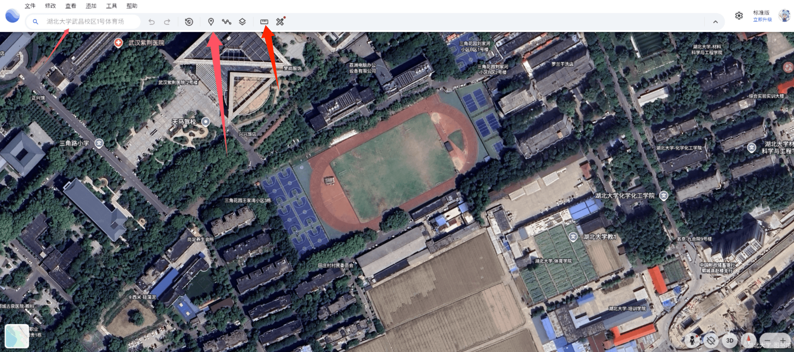
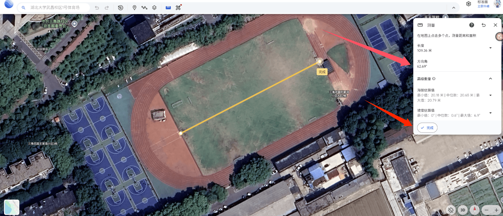
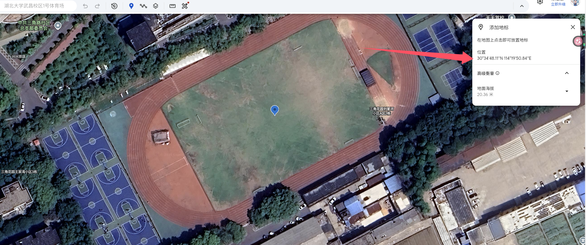

## 一、谷歌地球

连接VPN通过浏览器搜索进入谷歌地球，再在搜索框中搜索想要的学校，找到想要的操场。

注意：搜索时会自动给出一个坐标，但那是不准确的，**一定要以你在地图上看到的操场为准！**

**我们一共需要用到的就只有图中这个地标和尺子，分别用来测量经纬度和方位角。**接下来我以湖北大学一号体育场为例。

## 二、获取方位角

先获取操场的**方位角**（操场长轴与地球正北方向的夹角）。如图，点击左上角的尺子，点击足球场长轴偏南方的一头随后拉到另一头再次点击（看起来尽量穿过中心即可）。界面右边显示的**方向角**即为我们的**方位角**。点击完成即可。

按照习惯，方位角一般会是我们熟知的一些角度，比如 0°、62.5°、90° 等等。读者在自己估测时，最终结果可以向这些角度靠近，一般来说效果会更好。

## 三、获取经纬度

刚刚在操场上划过一条线，这样方便我们获取操场几何中心的经纬度。估计好几何中心后，点击左上角的地标移动到几何中心（点击可以固定一个地标，但注意先不要移开鼠标）。这时右侧会显示当前鼠标悬停点位的经纬度。记录下这个数据。

随后将刚刚记录的经纬度数据**转换单位**为**度（°），例如图中： 30°34'48.11" -> 30.580031°**。这样就获取了经纬度。

## 总结

我们获取了操场所需的全部数据：**方位角**和**经纬度（注意单位为度）**，接下来就可以将他们填入到软件的相应位置，进行轨迹生成啦。